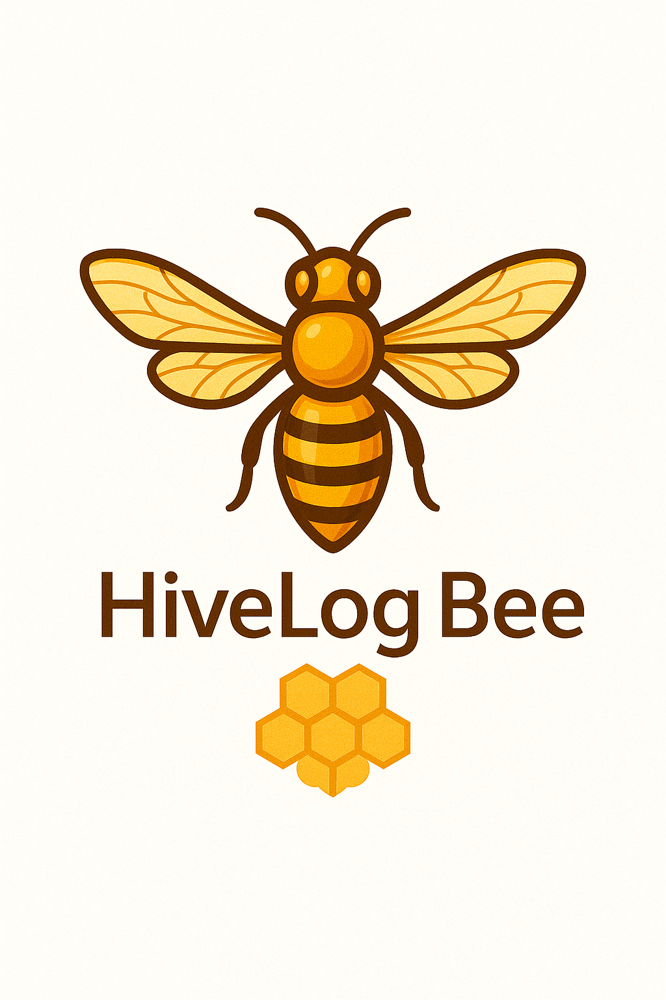

# HiveLog Bee - تطبيق إدارة المناحل

تطبيق شامل لإدارة المناحل والنحل، مصمم خصيصاً لمربي النحل في العالم العربي مع دعم لـ 7 لغات عالمية. تم بناء التطبيق باستخدام Flutter و Firebase لتقديم تجربة Real-time متكاملة.



## ✨ الميزات الرئيسية

- **إدارة شاملة**: إدارة المناحل، الخلايا، الفحوصات، العلاجات، والإنتاج.
- **Real-time Streams**: تحديثات فورية للبيانات باستخدام Firebase Firestore.
- **Pagination**: تحميل فعال للبيانات في القوائم الطويلة.
- **نظام تقسيم ذكي**: ترقية تلقائية للطرود إلى خلايا كاملة.
- **خرائط Google**: عرض مواقع المناحل مع تجمعات (clustering) وتراكب الطقس.
- **خدمة الطقس**: نصائح ذكية لمربي النحل بناءً على حالة الطقس.
- **تنبيهات ذكية**: إشعارات للفحوصات، العلاجات، وتحديثات الخلايا.
- **دعم 7 لغات**: العربية (الفصحى) هي اللغة الأساسية.
- **ثيمات متعددة**: داكن / فاتح / نظام.
- **تقارير متقدمة**: رسوم بيانية تفاعلية للإنتاج، الصحة، والمالية.
- **قسم المعرفة**: مقالات وفيديوهات تعليمية لمربي النحل.
- **إعلانات AdMob**: تحقيق الدخل من خلال إعلانات البانر والإعلانات البينية.

## 🚀 دليل التثبيت والتشغيل

### المتطلبات الأساسية

- [Flutter SDK](https://flutter.dev/docs/get-started/install) (إصدار 3.10.0 أو أحدث)
- [Android Studio](https://developer.android.com/studio) أو [Visual Studio Code](https://code.visualstudio.com/)
- حساب [Firebase](https://firebase.google.com/)

### 1. استنساخ المشروع

```bash
git clone https://github.com/YOUR_USERNAME/hivelog_bee.git
cd hivelog_bee
```

### 2. إعداد Firebase

1. قم بإنشاء مشروع جديد على [Firebase Console](https://console.firebase.google.com/).
2. أضف تطبيق Android جديد إلى مشروعك:
   - **اسم الحزمة (Package Name)**: `com.hivelog.bee`
3. قم بتنزيل ملف `google-services.json`.
4. ضع الملف في المسار التالي داخل المشروع: `android/app/google-services.json`.
5. في Firebase Console، انتقل إلى **Firestore Database** وقم بإنشاء قاعدة بيانات جديدة في وضع الإنتاج (Production mode).
6. انتقل إلى **Authentication** وقم بتمكين **Email/Password** كطريقة تسجيل دخول.

### 3. إعداد ملفات Android

1. افتح ملف `android/local.properties`.
2. قم بتحديث مسار `sdk.dir` و `flutter.sdk` ليتناسب مع جهازك:

   ```properties
   sdk.dir=/path/to/your/android/sdk
   flutter.sdk=/path/to/your/flutter/sdk
   ```

### 4. تثبيت التبعيات وتشغيل التطبيق

```bash
flutter pub get
flutter run
```

## 📂 هيكل المشروع

```
hivelog_bee/
├── android/          # ملفات تكوين Android
├── assets/           # الأصول (صور، خطوط، أيقونات)
│   ├── fonts/
│   ├── icons/
│   ├── images/
│   └── knowledge/
├── lib/              # كود المصدر للتطبيق
│   ├── l10n/         # ملفات الترجمة
│   ├── models/       # نماذج البيانات (Data Models)
│   ├── providers/    # مزودو الحالة (State Providers)
│   ├── screens/      # شاشات التطبيق
│   ├── services/     # خدمات الخلفية (Firebase, Weather, etc.)
│   ├── utils/        # أدوات مساعدة
│   └── widgets/      # واجهات مخصصة
├── pubspec.yaml      # ملف التبعيات والإعدادات
└── README.md         # هذا الملف
```

## 🤝 المساهمة

نرحب بالمساهمات! لا تتردد في فتح `issue` أو `pull request`.

## 📄 الترخيص

هذا المشروع مرخص بموجب ترخيص MIT. انظر ملف `LICENSE` لمزيد من التفاصيل.
